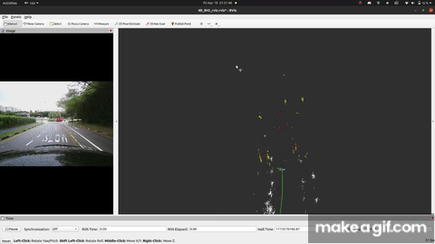
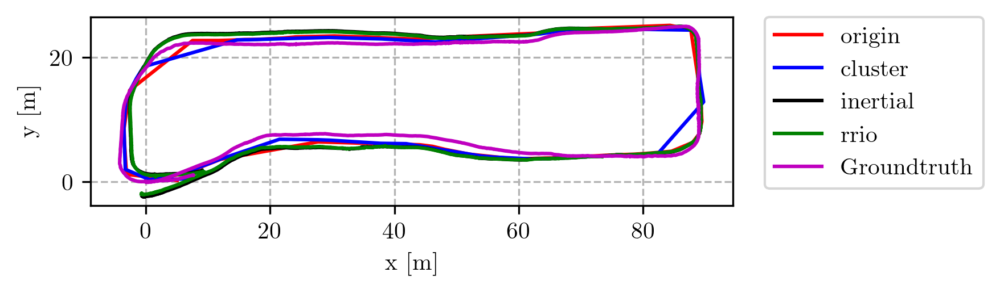
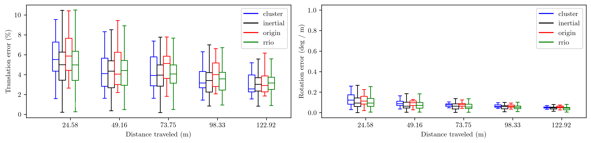

# 4D-RIO: 4D Radar Inertial Odometry (Tightly coupled 4D Radar IMU fusion approach)
## A Roboust localization framework for Autnomous driving in Adverse weather conditions and Geometrically degenerate environments

<!-- [project (ResearchGate)](https://www.researchgate.net/publication/371309896_4DRadarSLAM_A_4D_Imaging_Radar_SLAM_System_for_Large-scale_Environments_based_on_Pose_Graph_Optimization), [IEEEXplore](https://ieeexplore.ieee.org/document/10160670), [Video](https://www.youtube.com/watch?v=Qlvs7ywA5TI), [Dataset (NTU4DRadLM)](https://github.com/junzhang2016/NTU4DRadLM) -->

***4DRadarSLAM*** is an open source ROS package for real-time 6DOF SLAM using a 4D Radar and 9 axis IMU. It is based on 3D Graph SLAM with (Adaptive Probability Distribution GICP) scan matching-based radar odometry estimation, a tightly inertial fusion framwork with On manifold IMU preintegration and Incremental Graph optimization. Demonstrated a significant improvement in performance, reducing relative odometry error in translation by 14% and rotation by 26% compared to the baseline radar-only odometry methods. We extensively tested our alogithm using NTU 4D Radar-centric Multi-Modal Dataset for Localization and Mapping in outdoor structured (buildings), unstructured (trees and grasses) and semi-structured environments and Dynamic traffic scenes. The yellow points represent the filtered incomming radar pcl data, the red points denote outliers and points that belong to dynamic agents/objects in the scene. the green trajectory represents the fused radar+Inertial estimated odomtery.


<p align='center'>
    
</p>


## 1. Dependency
### 1.1 **Ubuntu** and **ROS**
Ubuntu 64-bit 18.04 or 20.04.
ROS Melodic or Noetic. [ROS Installation](http://wiki.ros.org/ROS/Installation):

### 1.2 ***4DRadarSLAM*** requires the following libraries:
- Eigen3
- OpenMP
- PCL
- g2o
### 1.3 The following ROS packages are required:
- [geodesy]
- [nmea_msgs]
- [pcl_ros]
- [LivoxLidarMsg_to_Pointcloud2_ros] (https://github.com/srirampr22/LivoxLidarMsg_to_Pointcloud2_ros)
- [ndt_omp] (https://github.com/koide3/ndt_omp)
- [livox_ros_driver] (https://github.com/Livox-SDK/livox_ros_driver)
- [fast_apdgicp](https://github.com/zhuge2333/fast_apdgicp), in which Adaptive Probability Distribution GICP algorithum module is added. The original is [fast_gicp](https://github.com/SMRT-AIST/fast_gicp)
```
    sudo apt-get install ros-XXX-geodesy ros-XXX-pcl-ros ros-XXX-nmea-msgs ros-XXX-libg2o
```
**NOTICE:** remember to replace "XXX" on above command as your ROS distributions, for example, if your use ROS-noetic, the command should be:
```
    sudo apt-get install ros-noetic-geodesy ros-noetic-pcl-ros ros-noetic-nmea-msgs ros-noetic-libg2o
```

## 2. System architecture
***4D-RRIO*** consists of three nodelets.

- *radar_preprocessing_node*
- *scan_matching_odometry_node*
- *imu_preintegration_node*

The input point cloud is first downsampled by ***preprocessing_nodelet***; the radar pointcloud is transformed to Livox LiDAR frame; estimate its ego velocity and remove dynamic objects, and then passed to the next nodelets. While scan_matching_odometry_nodelet estimates the sensor pose by iteratively applying a scan matching between consecutive frames (i.e., odometry estimation). the imu_preintegration_node handles the fusion of high rate IMU data from a 9 axis VectorNav-100 IMU leveraging On-Manifold IMU-Preintegration and Graph optimization via Incremental smoothing.

<div align="center">
    
</div>

## 3. Parameter tuning guide
The mapping quality largely depends on the parameter setting. In particular, scan matching parameters have a big impact on the result. Tune the parameters accoding to the following instructions:

### 3.1 Point cloud registration
- ***registration_method***

This parameter allows to change the registration method to be used for odometry estimation and loop detection. Our code gives five options: ICP, NDT_OMP, FAST_GICP, FAST_APDGICP, FAST_VGICP. 

FAST_APDGICP is the implementation of our proposed Adaptive Probability Distribution GICP, it utilizes OpenMP for acceleration. Note that FAST_APDGICP requires extra parameters.
Point uncertainty parameters:
- ***dist_var***
- ***azimuth_var***
- ***elevation_var***

*dist_var* means the uncertainty of a point’s range measurement at 100m range, *azimuth_var* and *elevation_var* denote the azimuth and elevation angle accuracy (degree)


## 4. Run the package
Download the loop2 dataset from [rosbag](https://drive.google.com/drive/folders/14jVa_dzmckVMDdfELmY32fJlKrZG1Afv?usp=sharing)  (**More datasets**: [NTU4DRadLM](https://github.com/junzhang2016/NTU4DRadLM)) to any folder as you wish, and then add the path to the rosbag in ***rrio_dataset_player.launch***. Then go ahead an launch this launch file below:

```
roslaunch rrio radar_inertial_odometry.launch
```

You can choose the dataset to play at end of the launch file.
In our project, we did evaluation on two datasets, localization results are presented below:
<div align="centre">
    
</div>

<div align="centre">
    
</div>

## 5. Evaluate the results
In our project, we use [rpg_trajectory_evaluation](https://github.com/uzh-rpg/rpg_trajectory_evaluation.git), the performance indices used are RE (relative odometry error).


## 7. Acknowlegement
1. 4DRRIO is based on [koide3/hdl_graph_slam](https://github.com/koide3/hdl_graph_slam) 
2. [christopherdoer/reve](https://github.com/christopherdoer/reve) radar ego-velocity estimator
3. [TixiaoShan/LIO-SAM](https://arxiv.org/abs/2007.00258) LIO-SAM: Tightly-coupled Lidar Inertial Odometry via Smoothing and Mapping 
4. [FastAPD-GICP/zhuge2333](https://github.com/zhuge2333/fast_apdgicp) Adaptive Probability Distribution GICP algorithm based on fast_gicp
4. C. Forster, L. Carlone, F. Dellaert and D. Scaramuzza, "On-Manifold Preintegration for Real-Time Visual--Inertial Odometry," in IEEE Transactions on Robotics, vol. 33, no. 1, pp. 1-21, Feb. 2017, doi: 10.1109/TRO.2016.2597321.
keywords: {Smoothing methods;Optimization;Estimation;Real-time systems;Manifolds;Computational modeling;Jacobian matrices;Computer vision;sensor fusion;visual--inertial odometry (VIO)}

